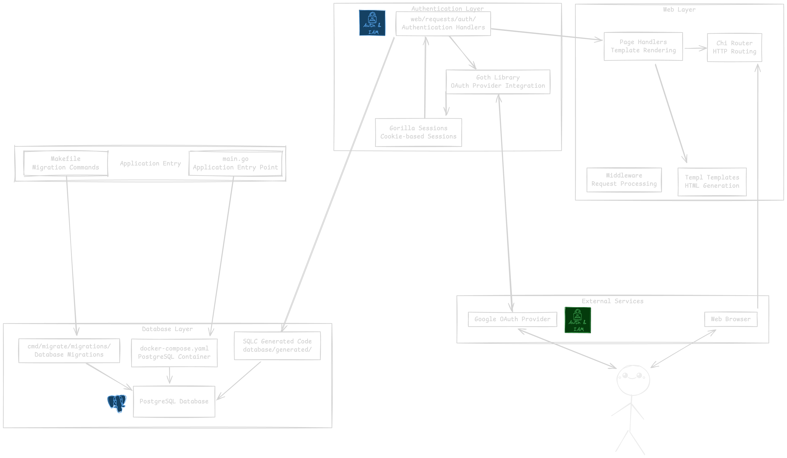

# Application Architecture

This Go application demonstrates OAuth authentication using Google as the provider. Below is the architectural overview of the application components and their interactions.

## Architecture Diagram

## Component Overview

### **Application Entry Point**
- **main.go**: The main application entry point that configures and starts the HTTP server
- **Makefile**: Provides convenient commands for running database migrations

### **Database Layer**
- **docker-compose.yaml**: Orchestrates the PostgreSQL database container
- **PostgreSQL Database**: Stores user data and OAuth identities
- **cmd/migrate/migrations/**: Contains database migration files managed by golang-migrate
- **SQLC Generated Code**: Type-safe Go code generated from SQL queries

### **Authentication & Session Management**
- **Goth Library**: Handles OAuth provider integration (Google)
- **Gorilla Sessions**: Manages cookie-based user sessions
- **Authentication Handlers**: Process OAuth login, callback, and logout requests

### **Web Layer**
- **Chi Router**: HTTP request routing and middleware
- **Middleware**: Request processing (logging, CORS, etc.)
- **Page Handlers**: Business logic for rendering pages
- **Templ Templates**: Type-safe HTML template generation

## Key Technologies

- **[Goth](https://github.com/markbates/goth)**: Multi-provider OAuth library for Go
- **[Gorilla Sessions](https://github.com/gorilla/sessions)**: HTTP session management
- **[golang-migrate](https://github.com/golang-migrate/migrate)**: Database migration tool
- **[SQLC](https://sqlc.dev/)**: Generates type-safe Go code from SQL
- **[Chi Router](https://github.com/go-chi/chi)**: Lightweight HTTP router
- **[Templ](https://templ.guide/)**: Type-safe Go templating language

## Development Workflow

1. **Database Setup**: Use `docker-compose up` to start PostgreSQL
2. **Migrations**: Run `make up` to apply database migrations
3. **Code Generation**: SQLC generates Go code from SQL queries
4. **Authentication**: Goth handles OAuth flow with Google
5. **Session Management**: Gorilla Sessions maintain user state
6. **Request Handling**: Chi router processes HTTP requests and renders responses